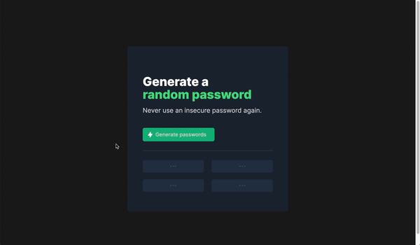

# Password Generator 🔐

## What is it?

Create random excellent passwords that isn't your name or DOB!

## Why did I create this?

One of my very first projects when starting out with JavaScript - a password generator. This project was focused on understanding basic JavaScript and transforming a Figma design into a working product.

## How to get it running -

It should be accessible through [here](https://diy-a.github.io/password-generator/)
